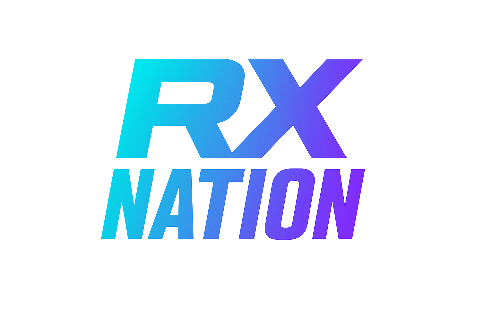
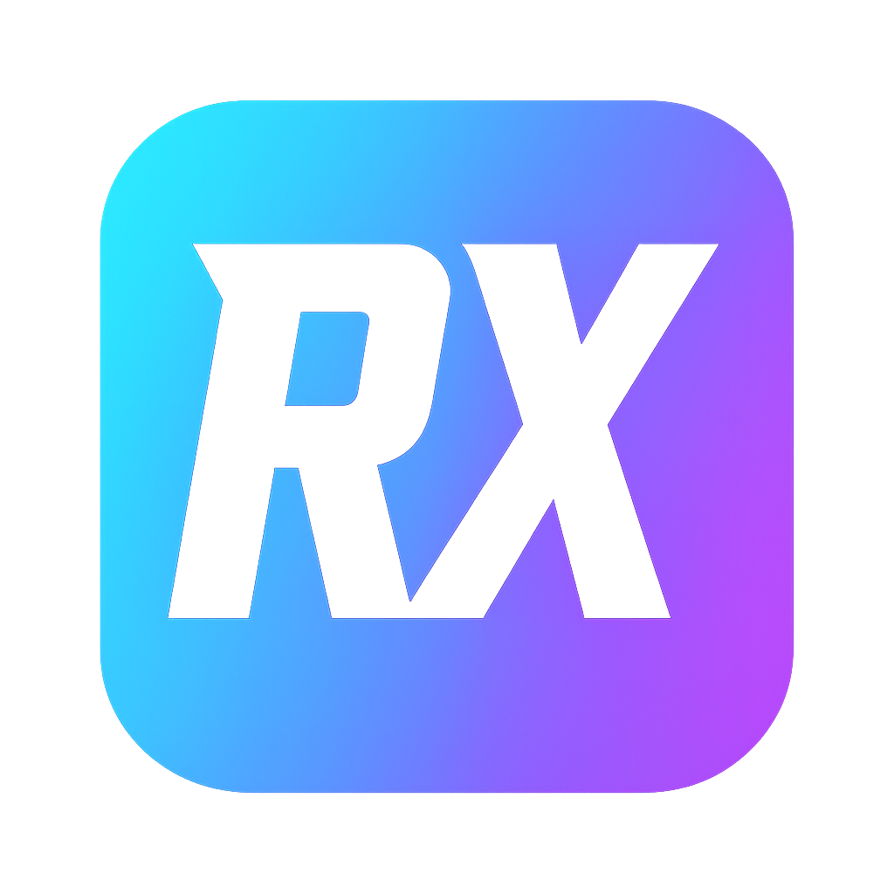

# Manual da Marca RX Nation

**Versão 1.0 | Novembro 2025**

---

## 📖 Índice

1. [Introdução](#introdução)
2. [Identidade Visual](#identidade-visual)
3. [Logos Oficiais](#logos-oficiais)
4. [Paleta de Cores](#paleta-de-cores)
5. [Tipografia](#tipografia)
6. [Área de Proteção](#área-de-proteção)
7. [Aplicações Corretas](#aplicações-corretas)
8. [Aplicações Incorretas](#aplicações-incorretas)
9. [Exemplos de Uso](#exemplos-de-uso)
10. [Contato](#contato)

---

## 🎯 Introdução

### Sobre a RX Nation

**RX Nation** é a plataforma líder para boxes de CrossFit no Brasil, transformando comunidades através de gamificação, dados e engajamento. Nossa marca representa **força, comunidade, evolução e tecnologia**.

### Propósito deste Manual

Este manual estabelece as diretrizes oficiais para uso da marca RX Nation. O objetivo é garantir consistência visual em todas as aplicações, fortalecendo o reconhecimento e a identidade da marca.

**Público-alvo deste manual:**
- Equipe interna de marketing e design
- Parceiros e boxes afiliados
- Agências e fornecedores externos
- Desenvolvedores e criadores de conteúdo

---

## 🎨 Identidade Visual

### Conceito da Marca

A identidade visual da RX Nation foi desenvolvida para transmitir:

- **Modernidade**: Gradientes vibrantes e tipografia bold representam inovação tecnológica
- **Energia**: Cores cyan e roxo evocam dinamismo e movimento
- **Comunidade**: O nome "NATION" reforça o senso de pertencimento
- **Performance**: Design atlético e impactante reflete alta performance

### Elementos Visuais

| Elemento | Descrição |
|----------|-----------|
| **Logotipo** | Letras "RX" em destaque com gradiente cyan-roxo |
| **Wordmark** | "NATION" em tipografia bold complementa o logo |
| **Ícone** | Versão quadrada simplificada para app icons |
| **Gradiente** | Transição suave de cyan (#00F5FF) para roxo (#8B5CF6) |

---

## 🏷️ Logos Oficiais

### Versões Aprovadas

A marca RX Nation possui **3 versões oficiais** aprovadas para uso:

#### 1. Logo em Fundo Branco


**Uso recomendado:**
- Documentos impressos e corporativos
- Apresentações com fundo claro
- Materiais institucionais
- Emails e newsletters

**Especificações:**
- Formato: PNG com fundo branco (#FFFFFF)
- Proporção: Landscape (16:9)
- Resolução mínima: 1920x1080px

---

#### 2. Logo em Fundo Preto


**Uso recomendado:**
- Apresentações dark mode
- Vídeos e motion graphics
- Redes sociais (posts e stories)
- Materiais promocionais

**Especificações:**
- Formato: PNG com fundo preto (#000000)
- Proporção: Landscape (16:9)
- Resolução mínima: 1920x1080px

---

#### 3. Ícone Quadrado


**Uso recomendado:**
- App icons (iOS, Android, PWA)
- Favicons de websites
- Perfis de redes sociais
- Avatares e miniaturas

**Especificações:**
- Formato: PNG com fundo gradiente
- Proporção: Quadrado (1:1)
- Resolução recomendada: 512x512px ou 1024x1024px
- Cantos arredondados: Raio de 22% (estilo iOS)

---

## 🎨 Paleta de Cores

### Cores Primárias

| Cor | Hex | RGB | Uso |
|-----|-----|-----|-----|
| **Cyan Principal** | `#00F5FF` | RGB(0, 245, 255) | Títulos, CTAs, destaques |
| **Roxo Secundário** | `#8B5CF6` | RGB(139, 92, 246) | Acentos, gradientes |
| **Rosa Acento** | `#FF006E` | RGB(255, 0, 110) | Elementos de destaque |

### Cores Neutras

| Cor | Hex | RGB | Uso |
|-----|-----|-----|-----|
| **Fundo Escuro** | `#0A0E27` | RGB(10, 14, 39) | Backgrounds, dashboards |
| **Cinza Escuro** | `#1A1F3A` | RGB(26, 31, 58) | Cards, containers |
| **Branco** | `#FFFFFF` | RGB(255, 255, 255) | Texto em fundos escuros |
| **Preto** | `#000000` | RGB(0, 0, 0) | Texto em fundos claros |

### Gradiente Oficial

```css
background: linear-gradient(135deg, #00F5FF 0%, #8B5CF6 100%);
```

**Aplicação do gradiente:**
- Logos e ícones principais
- Botões de ação primária
- Títulos de destaque
- Elementos decorativos

---

## ✍️ Tipografia

### Família Tipográfica Primária

**Oswald** (Google Fonts)
- Uso: Títulos, headlines, CTAs
- Pesos: Regular (400), SemiBold (600), Bold (700)
- Características: Condensada, impactante, atlética

```css
font-family: 'Oswald', sans-serif;
```

### Família Tipográfica Secundária

**Inter** (Google Fonts)
- Uso: Corpo de texto, parágrafos, UI
- Pesos: Regular (400), Medium (500), SemiBold (600)
- Características: Legível, moderna, versátil

```css
font-family: 'Inter', sans-serif;
```

### Hierarquia Tipográfica

| Elemento | Fonte | Tamanho | Peso | Uso |
|----------|-------|---------|------|-----|
| **H1** | Oswald | 48-64px | Bold (700) | Títulos principais |
| **H2** | Oswald | 36-48px | Bold (700) | Subtítulos |
| **H3** | Oswald | 24-32px | SemiBold (600) | Seções |
| **Body** | Inter | 16-18px | Regular (400) | Texto corrido |
| **Caption** | Inter | 12-14px | Medium (500) | Legendas |

---

## 🛡️ Área de Proteção

### Definição

A **área de proteção** é o espaço mínimo obrigatório ao redor do logo, livre de qualquer elemento visual (texto, imagens, bordas).

### Cálculo da Área de Proteção

**Regra:** A área de proteção equivale à **altura da letra "X"** do logo.

```
┌─────────────────────────────────┐
│         [Área Livre]            │
│                                 │
│    ┌─────────────────┐          │
│    │                 │          │
│    │   RX NATION     │ ← Logo   │
│    │                 │          │
│    └─────────────────┘          │
│                                 │
│         [Área Livre]            │
└─────────────────────────────────┘
     ↑                    ↑
  Margem X            Margem X
```

### Aplicação Prática

- **Mínimo obrigatório:** 1X em todos os lados
- **Recomendado:** 1.5X a 2X para maior respiro visual
- **Nunca:** Posicionar elementos dentro da área de proteção

---

## ✅ Aplicações Corretas

### Fundos Permitidos

| Fundo | Logo Recomendado | Observação |
|-------|------------------|------------|
| **Branco puro** | Logo fundo branco | Contraste ideal |
| **Preto puro** | Logo fundo preto | Alto impacto visual |
| **Cinza claro** | Logo fundo branco | Manter legibilidade |
| **Cinza escuro** | Logo fundo preto | Garantir contraste |

### Redimensionamento

✅ **Permitido:**
- Redimensionar proporcionalmente (manter aspect ratio)
- Ampliar ou reduzir mantendo qualidade
- Usar em diferentes resoluções

**Tamanhos mínimos recomendados:**
- **Digital:** 120px de largura (logo landscape)
- **Impresso:** 30mm de largura (logo landscape)
- **Ícone:** 48x48px mínimo

### Sobreposição em Imagens

✅ **Permitido com cautela:**
- Sobrepor logo em imagens com **fundo desfocado**
- Usar em áreas com **contraste adequado**
- Adicionar **sombra sutil** se necessário para legibilidade

**Exemplo de sombra permitida:**
```css
filter: drop-shadow(0 2px 8px rgba(0, 0, 0, 0.3));
```

---

## ❌ Aplicações Incorretas

### Proibições Absolutas

❌ **NUNCA:**

1. **Distorcer o logo**
   - Esticar horizontalmente ou verticalmente
   - Alterar proporções originais
   - Inclinar ou rotacionar

2. **Alterar cores**
   - Mudar o gradiente original
   - Usar cores fora da paleta oficial
   - Aplicar filtros de cor

3. **Adicionar efeitos**
   - Sombras excessivas ou brilhos
   - Texturas ou padrões
   - Contornos ou bordas

4. **Modificar elementos**
   - Separar "RX" de "NATION"
   - Alterar espaçamento entre letras
   - Substituir tipografia

5. **Fundos inadequados**
   - Fundos com baixo contraste
   - Imagens complexas sem tratamento
   - Cores que conflitam com o gradiente

### Exemplos de Uso Incorreto

| ❌ Erro | Descrição |
|---------|-----------|
| Logo esticado | Distorção horizontal ou vertical |
| Logo em fundo vermelho | Conflito com paleta de cores |
| Logo com sombra 3D | Efeito visual não autorizado |
| Logo rotacionado 45° | Orientação incorreta |
| Logo com borda dourada | Elemento não previsto |
| "RX" separado de "NATION" | Quebra da unidade visual |

---

## 💡 Exemplos de Uso

### 1. Website e Aplicativos

**Header/Navbar:**
```html
<!-- Logo no canto superior esquerdo -->

```

**Favicon:**
```html
<link rel="icon" href="icone-quadrado.png" sizes="512x512" />
<link rel="apple-touch-icon" href="icone-quadrado.png" />
```

---

### 2. Redes Sociais

| Plataforma | Formato | Logo Recomendado | Dimensões |
|------------|---------|------------------|-----------|
| **Instagram** | Foto de perfil | Ícone quadrado | 320x320px |
| **Instagram** | Posts | Logo fundo preto | 1080x1080px |
| **Facebook** | Capa | Logo fundo preto | 820x312px |
| **LinkedIn** | Logo empresa | Ícone quadrado | 300x300px |
| **Twitter/X** | Foto perfil | Ícone quadrado | 400x400px |

---

### 3. Materiais Impressos

**Cartões de Visita:**
- Logo fundo branco no verso
- Tamanho mínimo: 30mm de largura

**Camisetas:**
- Logo fundo preto para camisetas claras
- Logo fundo branco para camisetas escuras
- Posição: Centro do peito ou costas

**Banners e Faixas:**
- Logo fundo preto para máximo impacto
- Tamanho proporcional ao banner (mínimo 15% da largura)

---

### 4. Apresentações

**Slides com Fundo Claro:**
- Usar logo fundo branco
- Posição: Canto superior esquerdo ou direito
- Tamanho: 10-15% da largura do slide

**Slides com Fundo Escuro:**
- Usar logo fundo preto
- Mesmas diretrizes de posição e tamanho

---

### 5. Assinatura de Email

```html
<table style="font-family: Inter, sans-serif;">
  <tr>
    <td>
      
    </td>
    <td style="padding-left: 15px;">
      <strong style="font-size: 16px; color: #00F5FF;">Seu Nome</strong><br>
      <span style="font-size: 14px; color: #666;">Cargo | RX Nation</span><br>
      <span style="font-size: 12px; color: #999;">contato@rxnation.com.br | (11) 99999-9999</span>
    </td>
  </tr>
</table>
```

---

## 📐 Grid de Construção

### Proporções do Logo Landscape

O logo RX Nation segue um grid de construção baseado em **módulos X**:

```
Largura total: 16X
Altura total: 9X

RX: 8X de largura × 6X de altura
NATION: 14X de largura × 2.5X de altura
Espaçamento vertical entre RX e NATION: 0.5X
```

### Proporções do Ícone Quadrado

```
Dimensão: 1X × 1X (quadrado perfeito)
Letras RX: 0.7X de largura × 0.7X de altura (centralizadas)
Padding interno: 0.15X em todos os lados
Raio dos cantos: 0.22X (22% do tamanho total)
```

---

## 📦 Arquivos Disponíveis

### Estrutura de Pastas

```
marketing/
└── logos-oficiais/
    ├── logo-fundo-branco.png    (1.2 MB)
    ├── logo-fundo-preto.png     (1.8 MB)
    └── icone-quadrado.png       (1.4 MB)
```

### Formatos e Resoluções

| Arquivo | Formato | Resolução | Tamanho | Uso |
|---------|---------|-----------|---------|-----|
| `logo-fundo-branco.png` | PNG | 1920x1080px | 1.2 MB | Digital e impresso |
| `logo-fundo-preto.png` | PNG | 1920x1080px | 1.8 MB | Digital e impresso |
| `icone-quadrado.png` | PNG | 1024x1024px | 1.4 MB | App icons, perfis |

**Nota:** Todos os arquivos PNG possuem alta resolução (300 DPI equivalente) adequada para impressão profissional.

---

## 🔐 Direitos e Propriedade

### Propriedade Intelectual

A marca **RX Nation**, incluindo logotipo, ícone, paleta de cores e tipografia, é propriedade exclusiva da RX Nation Ltda. Todos os direitos reservados.

### Uso Autorizado

O uso da marca RX Nation é permitido apenas para:
- Comunicação oficial da empresa
- Parceiros e boxes afiliados autorizados
- Materiais promocionais aprovados
- Desenvolvedores integrando a plataforma

### Uso Não Autorizado

É **proibido** o uso da marca RX Nation para:
- Produtos ou serviços não relacionados
- Fins políticos ou religiosos
- Conteúdo ofensivo ou discriminatório
- Competidores diretos ou indiretos

---

## 📞 Contato

### Dúvidas sobre o Manual

Para esclarecimentos sobre aplicação da marca ou solicitação de formatos especiais:

**Email:** contato@rxnation.com.br  
**WhatsApp:** (11) 99999-9999  
**Website:** www.rxnation.com.br

### Aprovações

Materiais que utilizem a marca RX Nation devem ser submetidos para aprovação antes da publicação. Envie para:

**Email de aprovação:** marketing@rxnation.com.br  
**Prazo de resposta:** 2-3 dias úteis

---

## 📝 Histórico de Versões

| Versão | Data | Alterações |
|--------|------|------------|
| 1.0 | Novembro 2025 | Versão inicial do manual |

---

## 🎯 Checklist de Aplicação

Antes de usar a marca RX Nation, verifique:

- [ ] Estou usando uma das 3 versões oficiais aprovadas?
- [ ] O logo está em tamanho adequado (mínimo 120px digital / 30mm impresso)?
- [ ] A área de proteção está respeitada (mínimo 1X em todos os lados)?
- [ ] O fundo possui contraste adequado com o logo?
- [ ] O logo não foi distorcido, rotacionado ou modificado?
- [ ] As cores originais do gradiente foram mantidas?
- [ ] Não foram adicionados efeitos não autorizados?
- [ ] O material está alinhado com os valores da marca?

---

**RX Nation** — Transformando boxes em comunidades engajadas através de gamificação e dados.

*Manual da Marca v1.0 | Novembro 2025*
