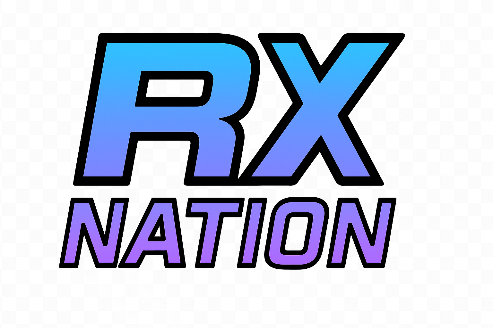

# Variações do Logo RX Nation

Este diretório contém todas as variações do logo RX Nation para diferentes contextos de uso.

## 📁 Arquivos Disponíveis

### Logos Completos (Landscape)

| Arquivo | Descrição | Uso Recomendado |
|---------|-----------|-----------------|
| `logo-transparente.png` | Logo com fundo transparente | Sites, apresentações, sobreposição em imagens |
| `logo-fundo-branco.png` | Logo em fundo branco | Documentos impressos, emails, materiais corporativos |
| `logo-fundo-preto.png` | Logo em fundo preto | Apresentações dark mode, vídeos, redes sociais |
| `logo-fundo-azul.png` | Logo em fundo azul (#00F5FF) | Materiais promocionais, banners, destaque visual |

### Ícones e Versões Reduzidas (Square)

| Arquivo | Descrição | Uso Recomendado |
|---------|-----------|-----------------|
| `icone-quadrado.png` | Ícone quadrado com gradiente | App icons, favicons, perfis de redes sociais |
| `icone-monocromatico-branco.png` | Ícone branco monocromático | Fundos escuros, impressão em uma cor, carimbos |
| `icone-monocromatico-preto.png` | Ícone preto monocromático | Fundos claros, documentos P&B, selos |

## 🎨 Paleta de Cores

- **Cyan Principal**: `#00F5FF`
- **Roxo Secundário**: `#8B5CF6`
- **Rosa Acento**: `#FF006E`
- **Fundo Escuro**: `#0A0E27`
- **Branco**: `#FFFFFF`
- **Preto**: `#000000`

## 📐 Especificações Técnicas

### Logos Completos
- **Formato**: PNG com alta resolução
- **Proporção**: 16:9 (landscape)
- **Resolução mínima**: 1920x1080px
- **Transparência**: Sim (exceto versões com fundo)

### Ícones
- **Formato**: PNG com alta resolução
- **Proporção**: 1:1 (quadrado)
- **Resolução recomendada**: 512x512px ou 1024x1024px
- **Transparência**: Sim

## 💡 Guia de Uso

### Para Sites e Apps
```html
<!-- Logo principal no header -->


<!-- Favicon -->
<link rel="icon" href="icone-quadrado.png" />

<!-- Open Graph / Social Media -->
<meta property="og:image" content="logo-fundo-azul.png" />
```

### Para Impressão
- **Documentos corporativos**: Use `logo-fundo-branco.png`
- **Camisetas escuras**: Use `icone-monocromatico-branco.png`
- **Camisetas claras**: Use `icone-monocromatico-preto.png`
- **Materiais promocionais**: Use `logo-fundo-azul.png` para destaque

### Para Apresentações
- **Slides com fundo claro**: Use `logo-transparente.png` ou `logo-fundo-branco.png`
- **Slides com fundo escuro**: Use `logo-fundo-preto.png` ou `logo-transparente.png`
- **Capa de apresentação**: Use `logo-fundo-azul.png` para impacto visual

### Para Redes Sociais
- **Foto de perfil**: Use `icone-quadrado.png`
- **Posts e stories**: Use `logo-fundo-azul.png` ou `logo-fundo-preto.png`
- **Banners**: Use `logo-transparente.png` sobreposto em imagens

## ⚠️ Diretrizes de Marca

### ✅ Permitido
- Redimensionar proporcionalmente
- Usar em fundos neutros ou da paleta de cores
- Sobrepor em imagens com contraste adequado
- Aplicar em materiais promocionais e merchandising

### ❌ Não Permitido
- Distorcer ou esticar o logo
- Alterar as cores do gradiente
- Adicionar efeitos (sombras, brilhos, texturas)
- Usar em fundos que comprometam a legibilidade
- Rotacionar ou inclinar o logo

## 📞 Contato

Para dúvidas sobre uso da marca ou solicitação de formatos especiais:
- **Email**: contato@rxnation.com.br
- **WhatsApp**: (11) 99999-9999

---

**RX Nation** - Transformando boxes em comunidades engajadas através de gamificação e dados.
